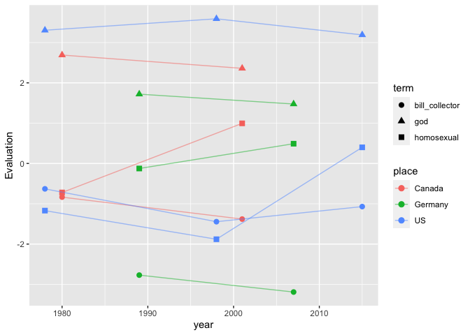

<!-- README.md is generated from README.Rmd. Please edit that file -->

# actdata

<!-- badges: start -->

<!-- badges: end -->

This package is intended to be a repository for standarized versions of
all publicly released affect control theory dictionaries and equations.
These datasets are currently stored in several different places and in
several different formats. Standardizing them and providing them
together in one R package is intended to make them easier to access and
make part of a reproducible analysis workflow.

Details on standarization procedures for dictionaries and equation sets,
instructions for how to access the data in this package, and a worked
example using the Tidyverse to manipulate these datasets are provided
below.

## Installation

You can install the development version of actdata from
[GitHub](https://github.com/) with:

``` r
# install.packages("devtools")
devtools::install_github("ahcombs/actdata")
```

## Dictionaries

This package makes available 25 affect control theory dictionaries that
have been publicly released. These dictionaries span nearly 45 years and
have been collected in many locations around the world.

To see details–including descriptions and citation information–for the
dictionaries available, call `dict_info()`. Include a dictionary key as
an argument to see information for just that dictionary:

``` r
library(actdata)
dict_info("nc1978")
#> Dictionary: nc1978
#> Description: From https://cs.uwaterloo.ca/~jhoey/research/ACTBackup/ACT/data.html: Ratings of 721 Identities, 600 Behaviors, 440 Modifiers, and 345 Settings were obtained with paper questionnaires from 1,225 North Carolina undergraduates. (Ratings for some emotion words in this data set were obtained by Heise from Indiana University undergraduates in 1985.) Number of male or female raters generally is about 25 for each word. Funded by National Institute of Mental Health Grant 1-R01-MH29978-01-SSR.
#> Components: identities, behaviors, mods, settings
#> Genders: male, female, av
#> Types: mean
#> Source: Interact 2.1 beta (May 2021)
#> Citation: Smith-Lovin, Lynn, and David R. Heise. Mean Affective Ratings of 2,106 Concepts by University of North Carolina Undergraduates in 1978 [Computer file]. Distributed at Affect Control Theory Website, Program Interact <http://www.indiana.edu/~socpsy/ACT/interact/JavaInteract.html>, 2006.
```

### Naming convention

Dictionary datasets are named according to the following format:

\[key\]\_\[component\]\_\[gender\]\_\[datatype\]\_dict

  - *Key* is an identifier unique to a particular study (e.g. `nc1978`;
    `morocco2015`). Call `dict_info()` to see the keys for the provided
    datasets.
  - *Component* indicates what kind of terms are included in the
    dictionary dataset. Typically, studies provide dictionary datasets
    with more than one component, but not all studies provide all
    possible components. Components include:
      - *identities:* Words that describe actors. Typically nouns
        (e.g. academic, woman, youngster)
      - *behaviors:* Actions that actors can perform. Typically verbs
        (e.g. wheedle, acclaim, work)
      - *mods:* Modifiers. Typically adjectives that can be applied to
        identities (e.g. active, witty, young)
      - *settings:* Places and situations (e.g. airplane, alley,
        worship\_service)
  - *Gender* indicates the gender of the participants who rated the
    terms. Options are `m`, `f`, and `av`. Av (average) indicates that
    participants of all genders were included, though the way this is
    calculated differs slightly by dictionary. Some dictionaries
    (e.g. the 2015 US, Morocco, and Egypt dictionaries) are originally
    published as average values over raters of all genders. In these
    cases, `av` is the only provided option. Other dictionaries are
    originally published in male and female subsets. Average values over
    all raters are not provided in these originally published sets. In
    this case, the package calculates an approximate average by
    averaging the male and female values. Typically, studies recruit
    approximately equal numbers of men and women and men and women’s
    ratings do not differ substantially on most terms, so we expect
    these approximate average values to be reasonably close to those
    that we would obtain from an average over all raters. For these
    dictionaries that provide male and female subsets separately, the
    package provides male, female, and approximate average versions. For
    more information on gender and affect control theory dictionaries,
    see section 4.1 of David Heise’s *Expressive Order* (2007).
  - *Datatype* is used when the desired dictionary provides variance
    information in addition to mean values. Most research in the affect
    control theory tradition to date has only utilized mean evaluation,
    potency, and activity values, and most dictionaries provide only
    means. However, BayesACT, a recent expansion of affect control
    theory, makes it possible to use variance information around these
    means (see Schröder, Hoey, and Rogers’s 2016 American Sociological
    Review publication for description of BayesACT). This package
    currently includes one dictionary (uga2015bayesactsubset) with
    standard deviation and covariance matrix data. The datasets
    corresponding to this dictionary include `SD` or `COV` in the
    `datatype` slot, depending on whether they include standard
    deviation or covariance matrix values. For all other dictionaries,
    which include means only, leave this slot empty.

See information on the structure and size of each data set using `?`.
Load data sets into your environment using `data()` with the desired
data set name as the argument (e.g.,
`data("egypt2015_identities_av_dict")`).

### Term standardization

To facilitate comparisons between dictionaries, the terms in all have
been transformed into a common format. All terms are provided in
all-lowercase and spelling and spacing have been made standard across
dictionaries (generally, the US spellings are chosen). Spaces are
represented by underscores in all dictionaries. Accents have been
removed. The code used to perform this standardization is located in
`standardize_dict_terms.R`, included in this package.

### Term tables

One of the main goals of this package is to make it easy to compare
across dictionaries. To this end, the package provides four *term
tables* that show at a glance which terms are included in which
dictionaries. There is one table for each component (identities,
behaviors, modifiers, settings). Load these tables into your environment
using `data()`:

``` r
data("term_table_ident")
data("term_table_beh")
data("term_table_mod")
data("term_table_set")
```

Each column in these tables represents a dictionary (labeled with its
key) and each row is a term. Cell entries (0/1) indicate whether or not
the specified dictionary has the specified term. These tables can easily
be modified further to generate summaries across a set of dictionaries
of interest.

## Equations

The second kind of data this package makes available are tables
containing estimates of affect control theory equation coefficients.
These coefficients can be used in conjunction with dictionaries to
calculate affective responses to various situations. See section 18.2 of
David Heise’s *Expressive Order* (2007) for a detailed description of
the structure and use of these tables.

To see information on all equation sets available in this package, call
`eqn_info()`. All of the available equation sets were originally sourced
from Interact (version 2.1 beta, accessed May 2021), and component
titles are based on labels applied in Interact.

### Naming convention

The equation datasets are named according to the following convention:

\[key\]\_\[component\]\_\[gender\]\_eqn

  - *Key* is a unique identifier for the study in which the equation
    coefficients were estimated. Some of these overlap with dictionary
    keys, but not all. All keys can be accessed using `eqn_info()`.
  - *Component* indicates the type of equations represented. The
    following components are possible (more information on each is
    available in section 18.2 of David Heise’s *Expressive Order*
    (2007)).
      - *impressionabo:* Impression change equations including actor,
        behavior, and object terms
      - *impressionabos:* Impression change equations including actor,
        behavior, object, and setting terms
      - *selfdir:* Equations for self-directed action, including actor
        and behavior terms.
      - *traitid:* Equations for combining a trait modifier with an
        identity. In some datasets, this set is the same as the
        emotionid set.
      - *emotionid:* Equations for combining an emotion modifier with an
        identity. In some datasets, this set is the same as the traitid
        set.
  - *Gender* indicates the gender of study participants whose ratings
    are used to estimate the equation coefficients. Options are `m`,
    `f`, and `av`. Call `dict_info()` to check which genders are
    available for which dictionaries. Interact, from which all of these
    equation sets were originally taken, provides male and
    female-labeled sets for each equation. However, sometimes these sets
    are identical. In this case, this package simply labels the set as
    `av` rather than including it twice. All values are provided exactly
    as they are in Interact–no post-hoc calculations have been
    performed.

## Writing files for Interact

Interact allows users to import their own dictionary and equation files.
Though many of the dictionaries and equation sets provided here are
available in Interact, several are not. Additionally, sometimes it is
useful to use subsets of dictionaries (e.g. when a user wants to
restrict the identities, behaviors, or modifiers available), and
creating these subsets within Interact itself, while possible, is
tedious and not easily replicable.

The `save_for_interact(data, type, filename)` function in this package
makes it easy to write dictionary and equation .txt files that are
correctly formatted for copying and pasting into Interact. The `data`
argument should be a dataframe that the user wishes to save (it can be
one of those provided, or one created by the user). `type` should be
either `dict` or `eqn` (by default, it is set to `dict`). `filename`
should be the filepath at which the user wishes to save the file (by
default, it saves to the working directory under the name of the
dataset). All filepaths must end in .txt.

## Working within and across dictionaries: an example using the Tidyverse

The Tidyverse makes it easy to create new combinations or subsets of
these dictionaries in a way that is completely replicable, and to
visualize quantities of interest over time and/or across countries. An
example of how these data sets can be used along with `dplyr`, `tidyr`,
and `ggplot` is included below.

Say we are interested in comparing changes in evaluation ratings for
identities over time in whatever countries possible. First, we look
through the available dictionaries to pick ones to use using
`dict_info()`. This produces lengthy output that is not duplicated here,
but users are encouraged to run this command to see the full list of
available dictionaries.

``` r
dict_info()
```

The three countries in which multiple dictionaries have been collected
are the U.S., Canada, and Germany. We choose three U.S. dictionaries
(nc1978, texas1998, and usfullsurveyor2015), two Canadian dictionaries
(ontario1980 and ontario2001), and two German dictionaries (germany1989
and germany2007). Now we need to find the identity terms that are in all
seven dictionaries. The term table is useful to quickly get a first look
at this.

``` r
library(dplyr)
#> 
#> Attaching package: 'dplyr'
#> The following objects are masked from 'package:stats':
#> 
#>     filter, lag
#> The following objects are masked from 'package:base':
#> 
#>     intersect, setdiff, setequal, union

data(term_table_ident)

term_table_short <- term_table_ident %>% 
  # we only need the columns for our chosen dictionaries
  select(term, nc1978, texas1998, usfullsurveyor2015, ontario1980, ontario2001, germany1989, germany2007) %>% 
  # filter to those terms present in all chosen dictionaries
  filter(nc1978 + texas1998 + usfullsurveyor2015 + ontario1980 + ontario2001 + germany2007 + germany1989 == 7)

head(term_table_short)
#>        term nc1978 texas1998 usfullsurveyor2015 ontario1980 ontario2001
#> 1  academic      1         1                  1           1           1
#> 2 adulterer      1         1                  1           1           1
#> 3 alcoholic      1         1                  1           1           1
#> 4 applicant      1         1                  1           1           1
#> 5 assistant      1         1                  1           1           1
#> 6   athlete      1         1                  1           1           1
#>   germany1989 germany2007
#> 1           1           1
#> 2           1           1
#> 3           1           1
#> 4           1           1
#> 5           1           1
#> 6           1           1
```

We now have a list of the 114 identities included in all seven
dictionaries. Now we need the evaluation values for these terms. These
are located in the dictionary objects. I will use the gender averaged
datasets here.

``` r
# there are many valid ways to join datasets together. Here I will use the inner_join function from the dplyr package. 

# load dictionaries into the global environment
data("nc1978_identities_av_dict")
data("texas1998_identities_av_dict")
data("usfullsurveyor2015_identities_av_dict")
data("ontario1980_identities_av_dict")
data("ontario2001_identities_av_dict")
data("germany1989_identities_av_dict")
data("germany2007_identities_av_dict")


# we don't actually need the modified term table we created to generate this subset--inner_join will do the filtering for us. However, it is useful for seeing quickly which terms are in which sets without having to load and manipulate the actual dictionaries. 
identity_subset <- inner_join(nc1978_identities_av_dict, texas1998_identities_av_dict, by = 'term', suffix = c("", ".texas1998")) %>% 
  inner_join(usfullsurveyor2015_identities_av_dict, by = 'term', suffix = c("", ".usfullsurveyor2015")) %>% 
  inner_join(ontario1980_identities_av_dict, by = 'term', suffix = c("", ".ontario1980")) %>% 
  inner_join(germany1989_identities_av_dict, by = 'term', suffix = c("", ".germany1989")) %>% 
  inner_join(germany2007_identities_av_dict, by = 'term', suffix = c("", ".germany2007")) %>% 
  inner_join(ontario2001_identities_av_dict, by = 'term', suffix = c(".nc1978", ".ontario2001")) %>% 
  # we only need the term column and evaluation columns
  select(term, starts_with("E"))

# Note that this data frame is longer (115 rows) than the list of identity terms in all datasets (114 rows). This is because there are multiple entries for some terms in some dictionaries (see "clown"). This is not an error in the package but rather a quirk of the original data. 

head(identity_subset)
#> # A tibble: 6 x 8
#> # Rowwise: 
#>   term      E.nc1978 E.texas1998 E.usfullsurveyor20… E.ontario1980 E.germany1989
#>   <chr>        <dbl>       <dbl>               <dbl>         <dbl>         <dbl>
#> 1 academic     0.975       1.83                 2.34          1.38          0.81
#> 2 adulterer   -1.80       -2.77                -2.98         -1.92         -1.6 
#> 3 alcoholic   -1.6        -2.30                -2.29         -1.84         -1.85
#> 4 applicant    0.55        0.925                1.12          0.75          0.73
#> 5 assistant    1.03        1.27                 1.51          0.78          0.84
#> 6 athlete      1.16        1.49                 1.81          1.16          1.27
#> # … with 2 more variables: E.germany2007 <dbl>, E.ontario2001 <dbl>
```

Now we have a dataframe that contains just the evaluation values for the
terms that the five dictionaries share. For visualization purposes, we
will transform this dataframe from wide to long using `pivot_longer()`
from the tidyr package. We will also randomly select three terms to
visualize.

``` r
library(tidyr)

set.seed(6)
random_terms <- data.frame(term = sample(identity_subset$term, 3))

identity_subset_toplot <- identity_subset %>% 
  semi_join(random_terms, by = "term") %>% 
  pivot_longer(starts_with('E'), 
               names_to = c('place', 'year'), 
               names_prefix = "E\\.", 
               names_sep = -4,
               values_to = "Evaluation") %>% 
  mutate(place = case_when(place %in% c("texas", "nc", "usfullsurveyor") ~ "US",
                           place == 'germany' ~ "Germany", 
                           TRUE ~ "Canada"),
         term_place = paste0(term, "_", place),
         year = as.numeric(year))
```

Now we can plot this using ggplot.

``` r
library(ggplot2)
ggplot(identity_subset_toplot, aes(x = year, y = Evaluation, group = term_place, color = place, shape = term)) +
  geom_point(size = 2.5) +
  geom_line(alpha = .5)
```


Perhaps unsurprisingly, the term “god” is rated as very good and “bill
collector” is rated modestly bad, and these ratings are relatively
stable across time in the three countries. “Homosexual” rises
substantially in evaluation in both the U.S. and Canada and rises
modestly in Germany, ending at roughly the same score in the three
countries. The rise in Canada appears to occur before the rise in the
US. It is not hard to imagine how this may have been driven by social
change in these countries during this time period.

How are meanings changing overall? We can calculate meaning change
summary statistics to get a better sense of this:

``` r
eval_change <- identity_subset %>% 
  mutate(change.US = E.usfullsurveyor2015 - E.nc1978,
         change.Germany = E.germany2007 - E.germany1989,
         change.Canada = E.ontario2001 - E.ontario1980) 

summary(select(eval_change, starts_with("change")))
#>    change.US       change.Germany     change.Canada    
#>  Min.   :-1.8600   Min.   :-1.82000   Min.   :-0.9800  
#>  1st Qu.:-0.2175   1st Qu.:-0.32500   1st Qu.:-0.0850  
#>  Median : 0.2300   Median :-0.01000   Median : 0.1600  
#>  Mean   : 0.1799   Mean   :-0.03345   Mean   : 0.1603  
#>  3rd Qu.: 0.6250   3rd Qu.: 0.28000   3rd Qu.: 0.4200  
#>  Max.   : 2.0350   Max.   : 1.22000   Max.   : 1.7150
```

Mean and median change for all three countries are close to 0,
suggesting broad stability in cultural meanings over time, but in all
three datasets there are terms which change meaning substantially. Let’s
find the terms that have undergone large changes in evaluation in at
least one of the countries:

``` r
eval_change_substantial <- eval_change %>% 
  filter(abs(change.US) > 1 | abs(change.Germany) > 1 | abs(change.Canada) > 1)

head(select(eval_change_substantial, term, starts_with("change")))
#> # A tibble: 6 x 4
#> # Rowwise: 
#>   term      change.US change.Germany change.Canada
#>   <chr>         <dbl>          <dbl>         <dbl>
#> 1 academic    1.36             0.795         0.26 
#> 2 adulterer  -1.18            -0.86         -0.395
#> 3 authority   0.00500         -1.82         -0.21 
#> 4 baby        0.0400           0.295         1.02 
#> 5 burglar    -1.16            -0.525        -0.145
#> 6 champion    1.08             0.62          0.265
```

This kind of cross-data set analysis can serve as a useful start point
to a study.
