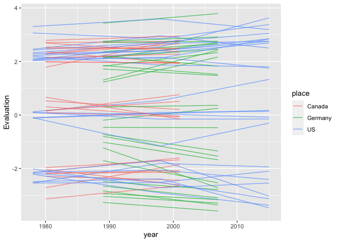

<!-- README.md is generated from README.Rmd. Please edit that file -->

# actdata

<!-- badges: start -->

<!-- badges: end -->

This package is intended to be a repository for standarized versions of
all publicly released affect control theory dictionaries and equations.
These datasets are currently stored in several different places and in
several different formats. Standardizing them and providing them
together in one R package is intended to make them easier to access and
make part of a reproducible analysis workflow.

Details on standarization procedures for dictionaries and equation sets
as well as instructions for how to access the data in this package are
provided below.

## Installation

You can install the development version of actdata from
[GitHub](https://github.com/) with:

``` r
# install.packages("devtools")
devtools::install_github("ahcombs/actdata")
```

## Dictionaries

This package makes available 25 affect control theory dictionaries that
have been publicly released. These dictionaries span nearly 45 years and
have been collected in many locations around the world.

To see details–including descriptions and citation information–for the
dictionaries available, call `dict_info()`. Include a dictionary key as
an argument to see information for just that dictionary:

``` r
library(actdata)
dict_info("nc1978")
#> Dictionary: nc1978
#> Description: From https://cs.uwaterloo.ca/~jhoey/research/ACTBackup/ACT/data.html: Ratings of 721 Identities, 600 Behaviors, 440 Modifiers, and 345 Settings were obtained with paper questionnaires from 1,225 North Carolina undergraduates. (Ratings for some emotion words in this data set were obtained by Heise from Indiana University undergraduates in 1985.) Number of male or female raters generally is about 25 for each word. Funded by National Institute of Mental Health Grant 1-R01-MH29978-01-SSR.
#> Components: identities, behaviors, mods, settings
#> Genders: male, female, av
#> Types: mean
#> Source: Interact 2.1 beta (May 2021)
#> Citation: Smith-Lovin, Lynn, and David R. Heise. Mean Affective Ratings of 2,106 Concepts by University of North Carolina Undergraduates in 1978 [Computer file]. Distributed at Affect Control Theory Website, Program Interact <http://www.indiana.edu/~socpsy/ACT/interact/JavaInteract.html>, 2006.
```

### Naming convention

Dictionary datasets are named according to the following format:

\[key\]\_\[component\]\_\[gender\]\_\[datatype\]\_dict

  - *Key* is an identifier unique to a particular study (e.g. `nc1978`;
    `morocco2015`). Call `dict_info()` to see the keys for the provided
    datasets.
  - *Component* indicates what kind of terms are included in the
    dictionary dataset. Typically, studies provide dictionary datasets
    with more than one component, but not all studies provide all
    possible components. Components include:
      -   - *identities*  
            Words that describe actors. Typically nouns (e.g. academic,
            woman, youngster)
    
      -   - *behaviors*  
            Actions that actors can perform. Typically verbs
            (e.g. wheedle, acclaim, work)
    
      -   - *mods*  
            Modifiers. Typically adjectives that can be applied to
            identities (e.g. active, witty, young)
    
      -   - *settings*  
            Places and situations (e.g. airplane, alley,
            worship\_service)
  - *Gender* indicates the gender of the participants who rated the
    terms. Options are `m`, `f`, and `av`. Av (average) indicates that
    participants of all genders were included, though the way this is
    calculated differs slightly by dictionary. Some dictionaries
    (e.g. the 2015 US, Morocco, and Egypt dictionaries) are originally
    published as average values over raters of all genders. In these
    cases, `av` is the only provided option. Other dictionaries are
    originally published in male and female subsets. Average values over
    all raters are not provided in these originally published sets. In
    this case, the package calculates an approximate average by
    averaging the male and female values. Typically, studies recruit
    approximately equal numbers of men and women and men and women’s
    ratings do not differ substantially on most terms, so we expect
    these approximate average values to be reasonably close to those
    that we would obtain from an average over all raters. For these
    dictionaries that provide male and female subsets separately, the
    package provides male, female, and approximate average versions. For
    more information on gender and affect control theory dictionaries,
    see section 4.1 of David Heise’s *Expressive Order* (2007).
  - *Datatype* is used when the desired dictionary provides variance
    information in addition to mean values. Most research in the affect
    control theory tradition to date has only utilized mean evaluation,
    potency, and activity values, and most dictionaries provide only
    means. However, BayesACT, a recent expansion of affect control
    theory, makes it possible to use variance information around these
    means (see Schröder, Hoey, and Rogers’s 2016 American Sociological
    Review publication for description of BayesACT). This package
    currently includes one dictionary (uga2015bayesactsubset) with
    standard deviation and covariance matrix data. The datasets
    corresponding to this dictionary include `SD` or `COV` in the
    `datatype` slot, depending on whether they include standard
    deviation or covariance matrix values. For all other dictionaries,
    which include means only, leave this slot empty.

Load data sets using `data()` with the desired data set name as the
argument. See information on the structure and size of each data set
using `?`.

### Term standardization

To facilitate comparisons between dictionaries, the terms in all have
been transformed into a common format. All terms are provided in
all-lowercase and spelling and spacing have been made standard across
dictionaries (generally, the US spellings are chosen). Spaces are
represented by underscores in all dictionaries. Accents have been
removed. The code used to perform this standardization is located in
`standardize_dict_terms.R`, included in this package.

### Term tables

One of the main goals of this package is to make it easy to compare
across dictionaries. To this end, the package provides four *term
tables* that show at a glance which terms are included in which
dictionaries. There is one table for each component (identities,
behaviors, modifiers, settings). Load these tables into your environment
using:

    * `data("term_table_ident")`
    * `data("term_table_beh")`
    * `data("term_table_mod")`
    * `data("term_table_set")`

Each column in these tables represents a dictionary (labeled with its
key) and each row is a term. Cell entries (0/1) indicate whether or not
the specified dictionary has the specified term. These tables can easily
be modified further to generate summaries across a set of dictionaries
of interest.

## Equations

The second kind of data this package makes available are tables
containing estimates of affect control theory equation coefficients.
These coefficients can be used in conjunction with dictionaries to
calculate affective responses to various situations. See section 18.2 of
David Heise’s *Expressive Order* (2007) for a detailed description of
the structure and use of these tables.

To see information on all equation sets available in this package, call
`eqn_info()`. All of the available equation sets were originally sourced
from Interact (version 2.1 beta, accessed May 2021), and component
titles are based on labels applied in Interact.

### Naming convention

The equation datasets are named according to the following convention:

\[key\]\_\[component\]\_\[gender\]\_eqn

  - *Key* is a unique identifier for the study in which the equation
    coefficients were estimated. Some of these overlap with dictionary
    keys, but not all. All keys can be accessed using `eqn_info()`.
  - *Component* indicates the type of equations represented. The
    following components are possible (more information on each is
    available in section 18.2 of David Heise’s *Expressive Order*
    (2007)).
      -   - *impressionabo*  
            Impression change equations including actor, behavior, and
            object terms
    
      -   - *impressionabos*  
            Impression change equations including actor, behavior,
            object, and setting terms
    
      -   - *selfdir*  
            Equations for self-directed action, including actor and
            behavior terms.
    
      -   - *traitid*  
            Equations for combining a trait modifier with an identity.
            In some datasets, this set is the same as the emotionid set.
    
      -   - *emotionid*  
            Equations for combining an emotion modifier with an
            identity. In some datasets, this set is the same as the
            traitid set.
  - *Gender* indicates the gender of study participants whose ratings
    are used to estimate the equation coefficients. Options are `m`,
    `f`, and `av`. Call `dict_info()` to check which genders are
    available for which dictionaries. Interact, from which all of these
    equation sets were originally taken, provides male and
    female-labeled sets for each equation. However, sometimes these sets
    are identical. In this case, this package simply labels the set as
    `av` rather than including it twice. All values are provided exactly
    as they are in Interact–no post-hoc calculations have been
    performed.

## Writing files for Interact

Interact allows users to import their own dictionary and equation files.
Though many of the dictionaries and equation sets provided here are
available in Interact, several are not. Additionally, sometimes it is
useful to use subsets of dictionaries (e.g. when a user wants to
restrict the identities, behaviors, or modifiers available), and
creating these subsets within Interact itself, while possible, is
tedious and not easily replicable.

The `save_for_interact(data, type, filename)` function in this package
makes it easy to write dictionary and equation .txt files that are
correctly formatted for copying and pasting into Interact. The `data`
argument should be a dataframe that the user wishes to save (it can be
one of those provided, or one created by the user). `type` should be
either `dict` or `eqn` (by default, it is set to `dict`). `filename`
should be the filepath at which the user wishes to save the file (by
default, it saves to the working directory under the name of the
dataset). All filepaths must end in .txt.

## Working within and across dictionaries: an example using the Tidyverse

The Tidyverse makes it easy to create new combinations or subsets of
these dictionaries in a way that is completely replicable, and to
visualize quantities of interest over time and/or across countries. An
example of how these data sets can be used along with `dplyr`, `tidyr`,
and `ggplot` is included below.

Say we are interested in comparing changes in evaluation ratings for
identities over time in whatever countries possible. First, we look
through the available dictionaries to pick ones to use:

``` r
dict_info()
#> Available dictionaries: 
#> 
#> Dictionary: china1999
#> Description: From https://cs.uwaterloo.ca/~jhoey/research/ACTBackup/ACT/data.html: Ratings of 449 Identities, 300 Behaviors, 98 Emotions, 150 Traits, and 149 Settings were obtained with Attitude from about 380 undergraduate students at Fudan University in Shanghai, Peoples Republic of China, 1999-2000.
#> Components: identities, behaviors, mods, settings
#> Genders: male, female, av
#> Types: mean
#> Source: Interact 2.1 beta (May 2021)
#> Citation: Smith, Herman, W. and Yi Cai. Mean Affective Ratings of 1,146 Concepts by Shanghai Undergraduates, 1999 [Computer file]. Distributed at Affect Control Theory Website, Program Interact <http://www.indiana.edu/~socpsy/ACT/interact/JavaInteract.html>, 2006.
#> 
#> Dictionary: egypt2015
#> Description: Data collected in Egypt between 2012 and 2014. n = 1716, identities = 397, behaviors = 368, modifiers = 233
#> Components: identities, behaviors, mods
#> Genders: male, female, av
#> Types: mean
#> Source: http://affectcontroltheory.org///egypt-dictionary-2015/
#> Citation: Hamid Latif, Lynn Smith-Lovin, Dawn T. Robinson, Bryan C. Cannon, Brent Curdy, Darys J Kriegel and Jonathan H. Morgan. 2016. "Mean Affective Ratings of Identities, Behaviors, and Modifiers by Residents of Cairo, Egypt in 2012-2014." University of Georgia: Distributed at UGA Affect Control Theory Website: http://research.franklin.uga.edu/act/.
#> 
#> Dictionary: expressive2002
#> Description: Appendix of Lisa Slattery Rashotte, 2002, What does that smile mean? The meaning of nonverbal behaviors in social interaction. Social Psychology Quarterly 65: 92-102. EPA values are means across 230 females and 172 males; these cross-sex EPA profiles are given in both the "male" and the "female" positions.
#> Components: behaviors
#> Genders: av
#> Types: mean
#> Source: https://cs.uwaterloo.ca/~jhoey/research/ACTBackup/ACT/interact/subcultures/expressive_acts.htm
#> Citation: Appendix of Lisa Slattery Rashotte, 2002, What does that smile mean? The meaning of nonverbal behaviors in social interaction. Social Psychology Quarterly 65: 92-102.
#> 
#> Dictionary: gaysex1980
#> Description: Data were gathered from ten San Francisco gay men in the 1980s by Professor Don Barrett, California State University, San Marcos. All data are from males. The 'male' dictionary present the mean EPA ratings of those with traditional sentiments about unsafe sex practices, feeling that those practices are more pleasurable than new practices. The 'female' dictionary shows the sentiments of those who think that safe-sex practices are more pleasurable.
#> Components: behaviors
#> Genders: male, female, av
#> Types: mean
#> Source: https://cs.uwaterloo.ca/~jhoey/research/ACTBackup/ACT/interact/subcultures/gay_sex.htm
#> Citation: unknown
#> 
#> Dictionary: germany1989
#> Description: From https://cs.uwaterloo.ca/~jhoey/research/ACTBackup/ACT/data.html: Ratings of 442 Identities, 295 Behaviors, and 67 Modifiers, selected for back-translatability with the 1978 U.S.A. dictionary were obtained with the Attitude program from 520 Mannheim students. Subjects were matched to the American undergraduate population by proportional inclusion of 12 and 13 grade youths at two German Studenten des Grundstudiums and Gymnasiasten, along with subjects from Mannheim University, which attracts students mainly from the Rhein-Neckar region in former West Germany.
#> Components: identities, behaviors, mods
#> Genders: male, female, av
#> Types: mean
#> Source: Interact 2.1 beta (May 2021)
#> Citation: Schneider, Andreas. Mean Affective Ratings of 804 Concepts by West German Students  in 1989 [Computer file]. Distributed at Affect Control Theory Website, Program Interact <http://www.indiana.edu/~socpsy/ACT/interact/JavaInteract.html>, 2006.
#> 
#> Dictionary: germany2007
#> Description: From https://cs.uwaterloo.ca/~jhoey/research/ACTBackup/ACT/data.html: Ratings of 376 Identities, 393 Behaviors, 331 Modifiers. (Some of the words are classified as 19 settings in Interact.) Ratings were obtained with Surveyor from 1905 subjects (734 male and 1171 female) from all over Germany. The research was advertised as a 'study of language and emotion' in an extensive recruitment campaign including mailing lists from different universities, weblogs, newspaper reports and radio interviews. Most of the participants (N = 1029) were between 20 and 29 years of age, but the sample covered all ages, including N = 129 being younger than 20 and N = 92 older than 60 years. The data of 83 persons (4.4 %) were excluded from the analysis, as they had indicated German not being their mother tongue.
#> Components: identities, behaviors, mods, settings
#> Genders: male, female, av
#> Types: mean
#> Source: Interact 2.1 beta (May 2021)
#> Citation: Schroder, Tobias. Mean Affective Ratings of 1100 Concepts by German Adults in 2007 [Computer file]. Distributed at Affect Control Theory Website, Program Interact <http://www.indiana.edu/~socpsy/ACT/interact/JavaInteract.html>, 2013.
#> 
#> Dictionary: household1994
#> Description: This set of concepts - developed by Professor Amy Kroska at the University of Oklahoma, and others, for studying gender and household roles - was rated by 23 male and 46 female college students in 1994.
#> Components: identities, behaviors
#> Genders: male, female, av
#> Types: mean
#> Source: https://cs.uwaterloo.ca/~jhoey/research/ACTBackup/ACT/interact/subcultures/household.htm
#> Citation: unknown
#> 
#> Dictionary: indiana2003
#> Description: From https://cs.uwaterloo.ca/~jhoey/research/ACTBackup/ACT/data.html: Ratings of 500 Identities, 500 Behaviors, 300 Modifiers, and 200 Settings were collected at Indiana University, via the Internet using the Surveyor applet.  The 1027 respondents lived in the U.S.A. at age 16, and were about equally male and female.
#> Components: identities, behaviors, mods, settings
#> Genders: male, female, av
#> Types: mean
#> Source: Interact 2.1 beta (May 2021)
#> Citation: Francis, Clare, and David R. Heise. Mean Affective Ratings of 1,500 Concepts by Indiana University Undergraduates in 2002-3 [Computer file]. Distributed at Affect Control Theory Website, Program Interact <http://www.indiana.edu/~socpsy/ACT/interact/JavaInteract.html>, 2006.
#> 
#> Dictionary: internationaldomesticrelations1981
#> Description: 125 inter-state behaviors. The behaviors were rated by professionals in international relations, and by individuals from the general population.
#> Components: behaviors
#> Genders: male, female, av
#> Types: mean
#> Source: https://cs.uwaterloo.ca/~jhoey/research/ACTBackup/ACT/interact/subcultures/international_relations.htm
#> Citation: Azar Edward E. and Steve Lerner 1981. The use of semantic dimensions in the scaling of international events. International Interactions 7: 361-378.
#> 
#> Dictionary: internet1998
#> Description: This set of concepts related to Internet culture was developed by Adam King, and rated by 2,431 respondents (56%  male and 44% female) in 1998.
#> Components: identities, behaviors, settings
#> Genders: male, female, av
#> Types: mean
#> Source: https://cs.uwaterloo.ca/~jhoey/research/ACTBackup/ACT/interact/subcultures/InternetCulture.htm
#> Citation: King, Adam B. 2001. "Affective dimensions of internet culture." Social Science Computer Review 19:414-430.
#> 
#> Dictionary: japan19892002
#> Description: From https://cs.uwaterloo.ca/~jhoey/research/ACTBackup/ACT/data.html: Ratings of 403 Identities and 307 Behaviors, and a few Settings were obtained with the Attitude program from 323 Tohoku University students in 1989. In 1995 and 1996, 120 women students at Kyoritsu Women's, Japan Women's, and Teikyo Universities and 120 men students at Teikyo and Rikkyo Universities rated an additional 300 settings, 300 modifiers (mainly traits), 200 business identities, and 75 behaviors. Yoichi Murase (Rikkyo University) and Nozomu Matsubara (Tokyo University) provided access to students who rated 102 emotions, 70 behaviors and 55 identities in 2002 using Surveyor. Total numbers of entries in Interact lexicon are: 713 Identities, 455 Behaviors, 426 Modifiers, and 300 Settings. Number of male or female raters generally is about 30 for each concept.
#> Components: identities, behaviors, mods, settings
#> Genders: male, female, av
#> Types: mean
#> Source: Interact 2.1 beta (May 2021)
#> Citation: Smith, Herman W., Takanori Matsuno, Shuuichirou Ike, and Michio Umino. Mean Affective Ratings of 1,894 Concepts by Japanese Undergraduates, 1989-2002 [Computer file]. Distributed at Affect Control Theory Website, Program Interact <http://www.indiana.edu/~socpsy/ACT/interact/JavaInteract.html>, 2006.
#> 
#> Dictionary: morocco2015
#> Description: Data collected in Morocco. n = 1546, identities = 397, behaviors = 368, modifiers = 233
#> Components: identities, behaviors, mods
#> Genders: male, female, av
#> Types: mean
#> Source: http://affectcontroltheory.org///morocco-dictionary-2015/
#> Citation: unknown
#> 
#> Dictionary: nc1978
#> Description: From https://cs.uwaterloo.ca/~jhoey/research/ACTBackup/ACT/data.html: Ratings of 721 Identities, 600 Behaviors, 440 Modifiers, and 345 Settings were obtained with paper questionnaires from 1,225 North Carolina undergraduates. (Ratings for some emotion words in this data set were obtained by Heise from Indiana University undergraduates in 1985.) Number of male or female raters generally is about 25 for each word. Funded by National Institute of Mental Health Grant 1-R01-MH29978-01-SSR.
#> Components: identities, behaviors, mods, settings
#> Genders: male, female, av
#> Types: mean
#> Source: Interact 2.1 beta (May 2021)
#> Citation: Smith-Lovin, Lynn, and David R. Heise. Mean Affective Ratings of 2,106 Concepts by University of North Carolina Undergraduates in 1978 [Computer file]. Distributed at Affect Control Theory Website, Program Interact <http://www.indiana.edu/~socpsy/ACT/interact/JavaInteract.html>, 2006.
#> 
#> Dictionary: nireland1977
#> Description: From https://cs.uwaterloo.ca/~jhoey/research/ACTBackup/ACT/data.html: Ratings of 528 Identities and 498 Behaviors were obtained with paper questionnaires from 319 Belfast teenagers in Catholic high schools in 1977. Ratings of modifiers and settings were not obtained in the Belfast study. Up to 18 females and  14 males rated each concept.
#> Components: behaviors, identities
#> Genders: male, female, av
#> Types: mean
#> Source: Interact 2.1 beta (May 2021)
#> Citation: Willigan, Dennis, and David R. Heise. Mean Affective Ratings of 1,026 Concepts by Catholic High School Students in Belfast, Northern Ireland in 1977 [Computer file]. Distributed at Affect Control Theory Website, Program Interact <http://www.indiana.edu/~socpsy/ACT/interact/JavaInteract.html>, 2006.
#> 
#> Dictionary: ontario1980
#> Description: From https://cs.uwaterloo.ca/~jhoey/research/ACTBackup/ACT/data.html: Data on 843 Identities and  593 Behaviors were obtained from 5,534 Guelph, Ontario, undergraduates with paper questionnaires in 1980-3, and 495 Modifiers rated by 1,260 Guelph undergraduates were added in 1985-6. Funded by the Social Science and Humanities Research Council of Canada.
#> Components: identities, behaviors, mods
#> Genders: male, female, av
#> Types: mean
#> Source: Interact 2.1 beta (May 2021)
#> Citation: MacKinnon, Neil J. Mean Affective Ratings of 1,931 Concepts by Guelph University Undergraduates, Ontario, Canada, in 1980-6 [Computer file]. Distributed at Affect Control Theory Website, Program Interact <http://www.indiana.edu/~socpsy/ACT/interact/JavaInteract.html>, 2006.
#> 
#> Dictionary: ontario2001
#> Description: From https://cs.uwaterloo.ca/~jhoey/research/ACTBackup/ACT/data.html: Data on 993 Identities, 601 Behaviors, and 500 Modifiers, and 200 Settings were gathered with the Attitude program from Guelph, Ontario, undergraduates in 2001-2. Data on settings were gathered with the Surveyor program at Guelph in 2003. Funded by the Social Science and Humanities Research Council of Canada. 
#> Components: identities, behaviors, mods, settings
#> Genders: male, female, av
#> Types: mean
#> Source: Interact 2.1 beta (May 2021)
#> Citation: MacKinnon, Neil J. Mean Affective Ratings of 2,294 Concepts by Guelph University Undergraduates, Ontario, Canada, in 2001-3 [Computer file]. Distributed at Affect Control Theory Website, Program Interact <http://www.indiana.edu/~socpsy/ACT/interact/JavaInteract.html>, 2006.
#> 
#> Dictionary: politics2003
#> Description: This set of concepts - developed by Kyle Irwin at the University of Missouri-St. Louis - was rated by 47 male and 74 female college students in 2003.
#> Components: behaviors, identities
#> Genders: male, female, av
#> Types: mean
#> Source: https://cs.uwaterloo.ca/~jhoey/research/ACTBackup/ACT/interact/subcultures/politics.htm
#> Citation: unknown
#> 
#> Dictionary: prisonersdilemma
#> Description: For use with a prisoner's dilemma example. Included with the BayesACT code.
#> Components: behaviors, identities, mods, emotions
#> Genders: male, female, av
#> Types: mean
#> Source: http://bayesact.ca/
#> Citation: unknown
#> 
#> Dictionary: prisonersdilemmaCOV
#> Description: For use with a prisoner's dilemma example. Contains covariance information. Included with the BayesACT code.
#> Components: behaviors
#> Genders: male, female, av
#> Types: mean
#> Source: http://bayesact.ca/
#> Citation: unknown
#> 
#> Dictionary: texas1998
#> Description: From https://cs.uwaterloo.ca/~jhoey/research/ACTBackup/ACT/data.html: Ratings of 443 Identities, 278 Behaviors, 65 Modifiers, and 1 Setting were collected at Texas Tech University with the Attitude program. The 482 respondents were nearly equally male and female.
#> Components: identities, behaviors, mods
#> Genders: male, female, av
#> Types: mean
#> Source: Interact 2.1 beta (May 2021)
#> Citation: Schneider, Andreas. Mean Affective Ratings of 787 Concepts by Texas Tech University Undergraduates in 1998 [Computer file]. Distributed at Affect Control Theory Website, Program Interact <http://www.indiana.edu/~socpsy/ACT/interact/JavaInteract.html>, 2006.
#> 
#> Dictionary: uga2015
#> Description: Sentiment dictionary data collected at the University of Georgia. n = 1368, identities = 930, behaviors = 814, modifiers = 660
#> Components: identities, behaviors, mods
#> Genders: av
#> Types: mean
#> Source: http://affectcontroltheory.org///usa-georgia-dictionary-2015/
#> Citation: Robinson, Dawn T., Lynn Smith-Lovin, Bryan C. Cannon, Jesse K. Clark, Robert Freeland, Jonathan H. Morgan and Kimberly B. Rogers. 2016. 'Mean Affective Ratings of 932 Identities, 810 Behaviors, and 660 Modifiers by University of Georgia Undergraduates in 2012-2014.'. University of Georgia: Distributed at UGA Affect Control Theory Website: http://research.franklin.uga.edu/act/.
#> 
#> Dictionary: usfullsurveyor2015
#> Description: Combined sentiment dictionary data collected at the University of Georgia, Duke University, and in the Durham, NC community using Surveyor. n = 1742, identities = 929, behaviors = 814, modifiers = 660
#> Components: identities, behaviors, mods
#> Genders: av
#> Types: mean
#> Source: http://affectcontroltheory.org///usa-combined-surveyor-dictionary-2015/
#> Citation: Smith-Lovin, Lynn, Dawn T. Robinson, Bryan C. Cannon, Jesse K. Clark, Robert Freeland, Jonathan H. Morgan and Kimberly B. Rogers. 2016. "Mean Affective Ratings of 929 Identities, 814 Behaviors, and 660 Modifiers by University of Georgia and Duke University Undergraduates and by Community Members in Durham, NC, in 2012-2014."" University of Georgia: Distributed at UGA Affect Control Theory Website: http://research.franklin.uga.edu/act/.
#> 
#> Dictionary: uga2015bayesactsubset
#> Description: Mean, standard deviation, and covariance data calculated using a subset of the University of Georgia 2015 dataset (uga2015 in this package). Included as part of the BayesACT package.
#> Components: identities, behaviors, mods
#> Genders: av
#> Types: cov, sd
#> Source: http://bayesact.ca/
#> Citation: unknown
#> 
#> Dictionary: usmturk2015
#> Description: Collected from Amazon Mechanical Turk workers in 2015. Identities = 968, behaviors = 853, modifiers = 660.
#> Components: identities, behaviors, mods
#> Genders: av
#> Types: mean
#> Source: http://affectcontroltheory.org///usa-online-dictionary-2015/
#> Citation: Smith-Lovin, Lynn, Dawn T. Robinson, Bryan C. Cannon, Brent H. Curdy, and Jonathan H. Morgan. 2019. 'Mean Affective Ratings of 968 Identities, 853 Behaviors, and 660 Modifiers by Amazon Mechanical Turk Workers in 2015.' University of Georgia: Distributed at UGA Affect Control Theory Website: http://research.franklin.uga.edu/act/
#> 
#> Dictionary: usstudent2015
#> Description: Combined sentiment dictionary data collected at the University of Georgia and Duke University using Surveyor. n = 1584, identities = 929, behaviors = 814, modifiers = 660
#> Components: identities, behaviors, mods
#> Genders: av
#> Types: mean
#> Source: http://affectcontroltheory.org///usa-student-surveyor-dictionary-2015/
#> Citation: Smith-Lovin, Lynn, Dawn T. Robinson, Bryan C. Cannon, Jesse K. Clark, Robert Freeland, Jonathan H. Morgan and Kimberly B. Rogers. 2016. 'Mean Affective Ratings of 929 Identities, 814 Behaviors, and 660 Modifiers by University of Georgia and Duke University Undergraduates in 2012-2014.' University of Georgia: Distributed at UGA Affect Control Theory Website: http://research.franklin.uga.edu/act/.
```

The three countries in which multiple dictionaries have been collected
are the U.S., Canada, and Germany. We choose three U.S. dictionaries
(nc1978, texas1998, and usfullsurveyor2015), two Canadian dictionaries
(ontario1980 and ontario2001), and two German dictionaries (germany1989
and germany2007). Now we need to find the identity terms that are in all
seven dictionaries. The term table is useful to quickly get a first look
at this.

``` r
library(dplyr)
#> 
#> Attaching package: 'dplyr'
#> The following objects are masked from 'package:stats':
#> 
#>     filter, lag
#> The following objects are masked from 'package:base':
#> 
#>     intersect, setdiff, setequal, union

data(term_table_ident)

term_table_short <- term_table_ident %>% 
  # we only need the columns for our chosen dictionaries
  select(term, nc1978, texas1998, usfullsurveyor2015, ontario1980, ontario2001, germany1989, germany2007) %>% 
  # filter to those terms present in all five datasets
  filter(nc1978 + texas1998 + usfullsurveyor2015 + ontario1980 + ontario2001 + germany2007 + germany1989 == 7)

head(term_table_short)
#>        term nc1978 texas1998 usfullsurveyor2015 ontario1980 ontario2001
#> 1  academic      1         1                  1           1           1
#> 2 adulterer      1         1                  1           1           1
#> 3 alcoholic      1         1                  1           1           1
#> 4 applicant      1         1                  1           1           1
#> 5 assistant      1         1                  1           1           1
#> 6   athlete      1         1                  1           1           1
#>   germany1989 germany2007
#> 1           1           1
#> 2           1           1
#> 3           1           1
#> 4           1           1
#> 5           1           1
#> 6           1           1
```

We now have a list of the `length(term_table_short)` identities included
in all seven dictionaries. Now we need the evaluation values for these
terms. These are located in the dictionary objects. I will use the
gender averaged datasets here.

``` r
# there are many valid ways to join datasets together. Here I will use the inner_join function from the dplyr package. 

# load dictionaries into the global environment
data("nc1978_identities_av_dict")
data("texas1998_identities_av_dict")
data("usfullsurveyor2015_identities_av_dict")
data("ontario1980_identities_av_dict")
data("ontario2001_identities_av_dict")
data("germany1989_identities_av_dict")
data("germany2007_identities_av_dict")


# we don't actually need the modified term table we created to generate this subset--inner_join will do the filtering for us. However, it is useful for seeing quickly which terms are in which sets without having to load and manipulate the actual dictionaries. 
identity_subset <- inner_join(nc1978_identities_av_dict, texas1998_identities_av_dict, by = 'term', suffix = c("", ".texas1998")) %>% 
  inner_join(usfullsurveyor2015_identities_av_dict, by = 'term', suffix = c("", ".usfullsurveyor2015")) %>% 
  inner_join(ontario1980_identities_av_dict, by = 'term', suffix = c("", ".ontario1980")) %>% 
  inner_join(germany1989_identities_av_dict, by = 'term', suffix = c("", ".germany1989")) %>% 
  inner_join(germany2007_identities_av_dict, by = 'term', suffix = c("", ".germany2007")) %>% 
  inner_join(ontario2001_identities_av_dict, by = 'term', suffix = c(".nc1978", ".ontario2001")) %>% 
  # we only need the term column and evaluation columns
  select(term, starts_with("E"))

# Note that this data frame is longer (115 rows) than the list of identity terms in all datasets (114 rows). This is because there are multiple entries for some terms in some dictionaries (see "clown"). This is not an error in the package but rather a quirk of the original data. 

head(identity_subset)
#> # A tibble: 6 x 8
#> # Rowwise: 
#>   term      E.nc1978 E.texas1998 E.usfullsurveyor20… E.ontario1980 E.germany1989
#>   <chr>        <dbl>       <dbl>               <dbl>         <dbl>         <dbl>
#> 1 academic     0.975       1.83                 2.34          1.38          0.81
#> 2 adulterer   -1.80       -2.77                -2.98         -1.92         -1.6 
#> 3 alcoholic   -1.6        -2.30                -2.29         -1.84         -1.85
#> 4 applicant    0.55        0.925                1.12          0.75          0.73
#> 5 assistant    1.03        1.27                 1.51          0.78          0.84
#> 6 athlete      1.16        1.49                 1.81          1.16          1.27
#> # … with 2 more variables: E.germany2007 <dbl>, E.ontario2001 <dbl>
```

Now we have a dataframe that contains just the evaluation values for the
terms that the five dictionaries share. For visualization purposes, we
will transform this dataframe from wide to long using `pivot_longer`
from the tidyr package and cut it down to a manageable number of
identities by filtering for those that are very positive (E \> 2), very
negative (E \< -2) or neutral (-.15 \< E \< .15). We will also add in a
column for year and a column for country, to aid visualization.

``` r
library(tidyr)
identity_subset_toplot <- identity_subset %>% 
  # base filtering on nc1978
  filter(E.nc1978 > 2 |
           E.nc1978 < -2 |
           (E.nc1978 > -.15 & E.nc1978 < .15)) %>%
  pivot_longer(starts_with('E'), 
               names_to = c('place', 'year'), 
               names_prefix = "E\\.", 
               names_sep = -4,
               values_to = "Evaluation") %>% 
  mutate(place = case_when(place %in% c("texas", "nc", "usfullsurveyor") ~ "US",
                           place == 'germany' ~ "Germany", 
                           TRUE ~ "Canada"),
         term = paste0(term, "_", place),
         year = as.numeric(year))
```

Now we can plot this using ggplot.

``` r
library(ggplot2)
ggplot(identity_subset_toplot, aes(x = year, y = Evaluation, group = term, color = place)) +
  geom_line(alpha = .7)
```


